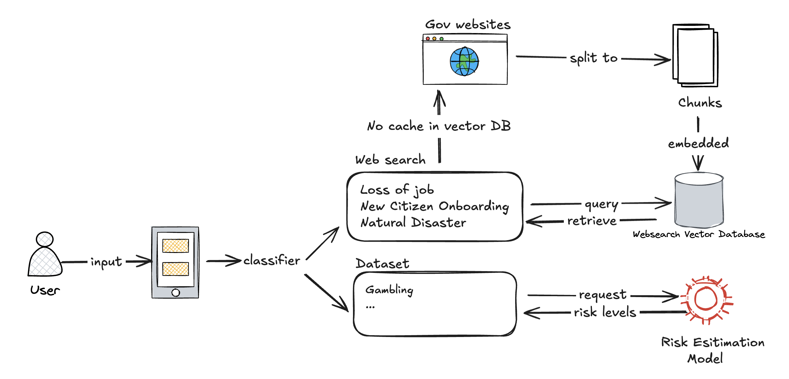

# Discover Services System

## Addressing the Data Landscape Problem

Our **Open Data Relevancy Analysis Engine** addresses service discovery challenges through an intelligent, hybrid approach that bridges the gap between citizen needs and available services.

### Our Solution Components

1. **Discovery-to-Integration Pipeline**
   - AI-powered service need analysis using Claude
   - Hybrid search combining vector database cache and live web search
   - Intelligent relevance filtering and service validation

2. **Consolidated Data Model**
   - Unified service schema across multiple sources
   - Vector embeddings for semantic similarity matching
   - Persona-based service categorization and priority scoring

3. **Data Source Integration**
   - **Public Data**: Web search via SerpAPI for comprehensive service discovery
   - **Auxiliary Data Sources**: AI-enhanced service summaries and classifications
   - **Private Data with Consent**: Vector database caching for privacy-aware storage
   - **Gap Analysis**: Identifies service availability vs citizen needs through fallback scenarios

4. **Insights and Recommendations Engine**
   - AI-powered service need analysis and recommendation matching
   - Relevance scoring with cosine similarity algorithms
   - Performance optimization through intelligent caching

## Demo Approach: Service Relevancy Analysis Engine

**The Process**: Our Service Relevancy Analysis Engine identifies citizen service needs, searches multiple data sources, and delivers personalized service recommendations.

**Demo Focus**: We demonstrate the complete service discovery pipeline:

1. **Service Need Analysis**: Claude AI analyzes citizen questions to identify 3-4 service categories
2. **Hybrid Search**: Vector database check followed by targeted web search via SerpAPI
3. **Relevance Filtering**: AI-powered filtering to ensure results are actual services (not job listings or irrelevant content)
4. **Smart Caching**: Store discovered services in vector database for future similarity matching

This demonstrates our capability to bridge the service discovery gap - connecting citizens with relevant support services efficiently.

## System Architecture

## Technical Implementation

### Core Components
- **AI Analysis Layer** (`route.ts`): Claude-powered service need identification
- **Vector Storage Layer**: Semantic caching with embedding similarity
- **Web Search Layer**: SerpAPI integration for live service discovery
- **Relevance Filter**: AI-powered service validation and classification
- **UI Layer** (`DynamicServicesDisplay.tsx`): Persona-aware service interface

### Key Features
- **Intelligent Service Matching**: Vector similarity for cached results
- **Live Discovery**: Real-time web search for new service needs
- **Relevance Validation**: AI filtering to ensure service quality
- **Performance Optimization**: Hybrid cache-first search strategy