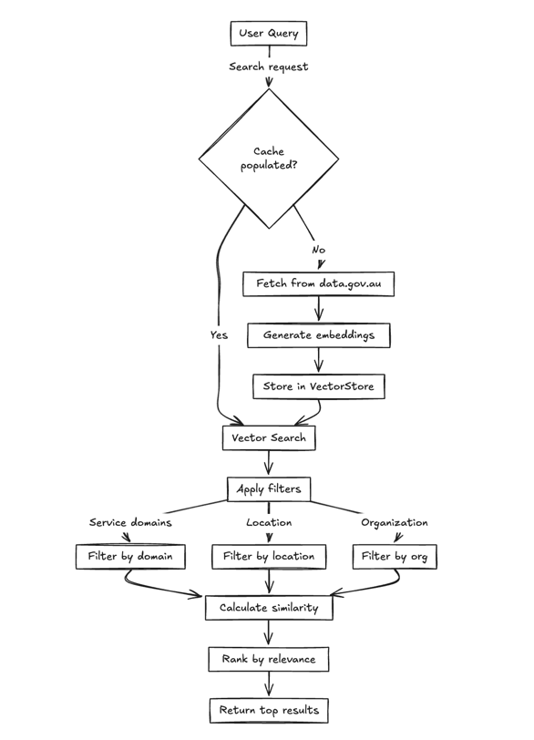

# Dataset Discovery System

## Addressing the Data Landscape Problem

Our **Open Data Relevancy Analysis Engine** tackles the challenge of discovering and utilizing relevant government datasets through an intelligent, multi-layered approach:

### Our Solution Components

1. **Discovery-to-Integration Pipeline**
   - Automated dataset ingestion from data.gov.au
   - Vector-based semantic search for relevance matching
   - Metadata enrichment and service domain classification

2. **Consolidated Data Model**
   - Unified dataset schema across government sources
   - Standardized metadata extraction and processing
   - 15 predefined service domains for consistent categorization

3. **Data Source Integration**
   - **Public Data**: Australian government open data portal
   - **Auxiliary Data Sources**: Metadata enrichment through AI processing
   - **Private Data with Consent**: Framework ready for controlled data integration
   - **Gap Analysis**: Identifies missing data vs solution requirements

4. **Insights and Recommendations Engine**
   - AI-powered dataset analysis for actionable insights
   - Relevance scoring and recommendation algorithms
   - Performance analytics and search optimization

## Demo Approach: Data Relevancy Analysis Engine

**The Process**: Our Data Relevancy Analysis Engine identifies relevant datasets, learns from their content, and delivers intelligent recommendations to users.

**Demo Focus**: Due to time constraints, we demonstrate the critical first step of dataset discovery:

1. **Vector Database Population**: We embed all dataset names and descriptions using OpenAI's embedding model
2. **Metadata Integration**: Source data from `https://data.gov.au/data/api/3/action/package_search`
3. **Relevance Demonstration**: For each use case, we manually retrieve the most relevant datasets, showcasing our discovery engine's capability to identify contextually appropriate data sources

This demonstration validates our approach to solving the data discovery challenge - the foundation for building comprehensive data-driven solutions.

## System Architecture

## Technical Implementation

### Core Components
- **Data Fetching Layer** (`dataset-fetcher.ts`): Handles data.gov.au API communication
- **Vector Storage Layer** (`dataset-vector-store.ts`): Manages embeddings and similarity search
- **API Layer** (`route.ts`): REST endpoints for search, populate, stats, debug
- **UI Layer** (`page.tsx`): React interface with intelligent filtering

### Key Features
- **Semantic Search**: Vector embeddings for content understanding
- **Multi-dimensional Filtering**: Service domains, geography, organization, temporal
- **Relevance Scoring**: Cosine similarity with domain-specific boosting
- **Real-time Analytics**: Search performance and effectiveness metrics
